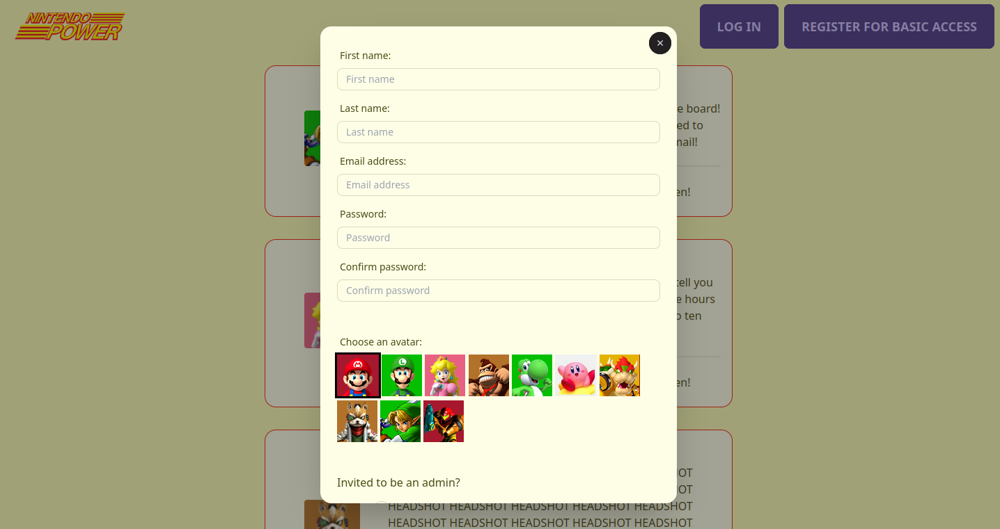

# Readme
# Super Power Club (Members Only)!

## Overview

This is a Nintendo Power themed message board, built as a multi-page Express (Node JS) app.  
Authentication and authorization were implemented via the Passport Local Strategy to create multiple
levels of access ("basic", admin, and Super Power Club member) and restrict and enable different 
features to them respectively.  Like always, this app was built mobile-first with responsive design.

### Screenshot

  

### Links

- [Live site](#)
- [Repo](https://github.com/mattdimicelli/Members_Only)

## My process

### Built with

- Form validation on the front-end and the back-end, with reporting of validation errors from back-end (eg. in case user was somehow able to bypass front-end validation)
- BcryptJS for password encryption
- MongoDB via Mongoose
- EJS templating engine
- TailwindCSS with some modified UI components from DaisyUI

### What I learned

The Local Strategy is Passport's most used strategy.  Although session-based authentication is 
probably the oldest choice, it is not obsolete.  Although Passport's documentation is somewhat 
lacking, I researched and was able to learn how cookies, express-session, Passport, the strategy and
the encryption work together to accomplish a common goal.

Since I had employed Helmet for added security but also utilized inline scripts, I had to learn 
about Content Security Policy in order to configure Helmet to allow the scripts.

I started off implementing the backend valdidation (of user inputted data from forms) in the 
Mongoose schema.  However, I learned that this strategy would only work for data that corresponded
to the schema/model.  Any form data that wasn't being passed into the schema as arguments would not
be validated.  For example, I had to validate the strings from the password and password 
confirmation inputs, but I did was not storing the password nor the password confirmation in the 
User schema/model.  Rather, a hash was being created and that hash was what was being stored in the
database.  So, I had to find another way to validate the password and the password confirmation.
I ended up implementing this with custom code.  In case of any backend validation error(s), the user
is redirected back to the form that he/she submitted and the errors are reported.  I made this a bit
more complicated by myself by utilizing modals for the log in and sign up pages (as opposed to 
seperate pages with distinct URLs), but it was all in good learning, since I learned about the many
options that you have when passing data (in this case, the validation errors) to a page on a 
redirect: query strings, storing the data on the session object, as well as "flashing" the data (eg. via connect-flash).  I utilized the latter two of these in different parts of the app for learning purposes.  

On the front-end side, I validated an input or two using the JS Constraint Validation API (as well
as the built-in HTML form valdidation) but turned to a schema-based library called Just Validate for
the larger and more complex signup form.  Oh, schema-based validation is so nice!

Note for improvement: in future projects I would look further into a AJV, which is another 
schema-based validation library which might allow for using the same schema on both the front end 
and the back end.

Also, Heroku's free tier does not provide a static IP address.  This is problematic in regards to MongoDB since MongoDB requires that any client
that accesses the database has it's IP address in a whitelist.  Despite trying several programs/services such as Fixie, which provide you with a static IP address to use for this purpose, I was unable to find a work-around actually functioned.  My imperfect solution was to allow connections to MongoDB from all IP addresses.  For a commercial project or a project that requires mores security, 
this would obviously not be sufficient and another solution would be needed.
